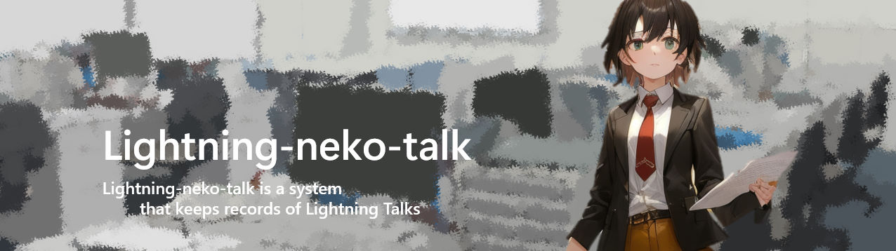

<div></div>

<div align="center">Lightning-neko-talk is a system that keeps records of Lightning Talks</div>

---

- [Installation](#installation)
- [Setup](#setup)
- [UsageApi](#api)
- [UsageFrontend](#frontend)

# Installation

```bash
$ git clone https://github.com/jinwatanabe/lightning-neko-talk.git
$ cd lightning-neko-talk
```

# Setup

```bash
$ cd environment
$ make neko

# after using
# $ make stop
```

# API

```bash
$ cd lt-api

# run server
$ make run

# run test
$ make test
```

# Frontend

```bash
$ cd lt-frontend

# run server
$ make dev

# run test
$ make test
```
